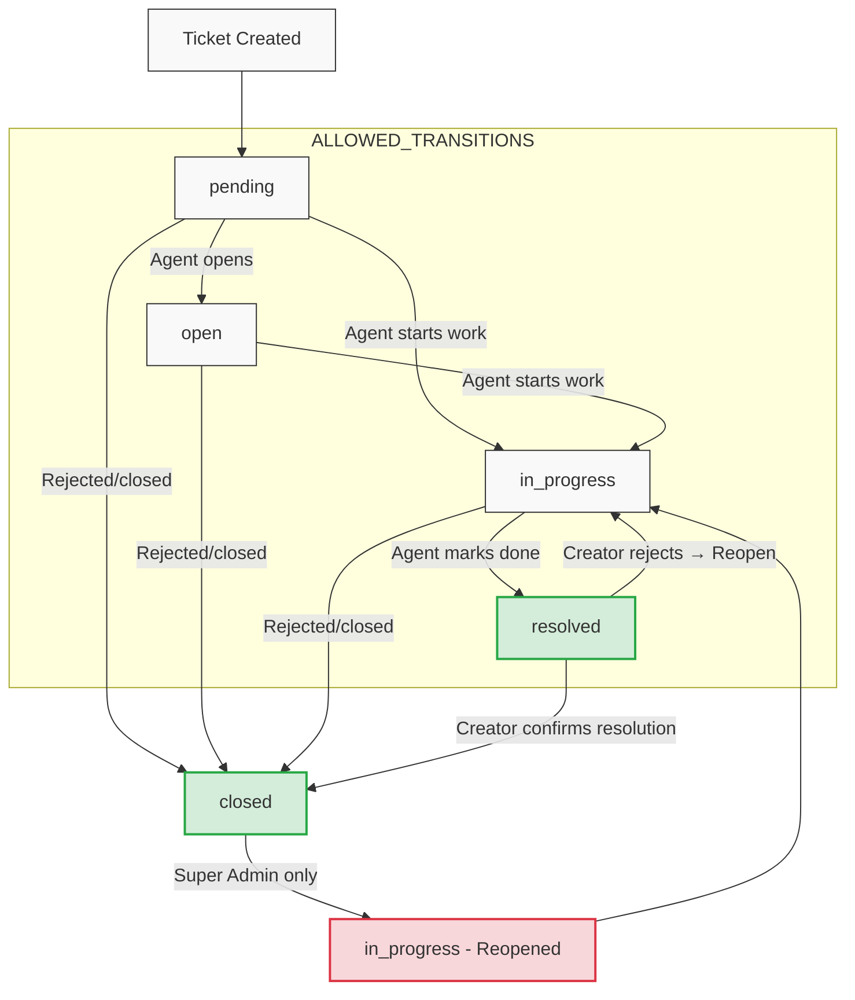
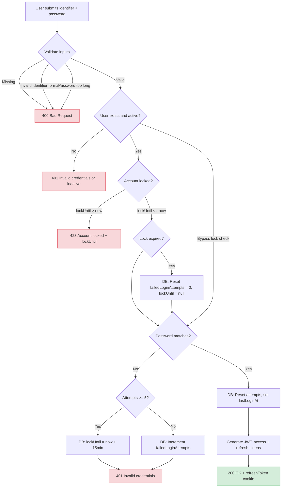

# Activity Diagrams

---

## 1. Ticket Lifecycle

**Sources:** `workflow.constants.ts:1-18`, `tickets.service.ts:409-488`, `tickets.service.ts:650-689`



### Transition Rules (`workflow.constants.ts:7-18`)

| From | To | Notes |
|------|-----|-------|
| `pending` | `open`, `in_progress`, `closed` | Direct closure allowed |
| `open` | `in_progress`, `closed` | |
| `in_progress` | `resolved`, `closed` | |
| `resolved` | `in_progress` | Reopen only. CLOSING requires creator confirmation (`tickets.service.ts:650-689`) |
| `closed` | `in_progress` | Super Admin only (`tickets.service.ts:428-429`) |

### Key Enforcement Points

- **Resolved → Closed path:** Must go through `PUT /api/tickets/:id/confirm` (`tickets.controller.ts:96`), which verifies the user is the ticket creator (`tickets.service.ts:658-659`). Optionally captures rating/feedback.
- **Reopen from resolved:** Agent transitions to `in_progress` — no special guard (`workflow.constants.ts:16`).
- **Reopen from closed:** Only `super_admin` (`tickets.service.ts:428-429` with `REOPEN_FORBIDDEN`).
- **Resolve requires assignment:** Cannot resolve unassigned ticket (`tickets.service.ts:432-434` — `ASSIGNMENT_REQUIRED`).
- **Resolve requires ticket type:** Issue type must be set before resolving/closing (`tickets.service.ts:437-439` — `ISSUE_TYPE_REQUIRED`).

---

## 2. User Authentication Flow

**Sources:** `auth.service.ts:12-93`



### Lockout Parameters

| Parameter | Value | Source |
|-----------|-------|--------|
| Max attempts | `5` | `auth.service.ts:58` |
| Lockout duration | `15 minutes` | `auth.service.ts:59` |
| Password hash rounds | `12` | `admin-users.controller.ts:62` |
| Refresh token expiry | `7 days` | `auth.controller.ts:27` |
| Identifier regex | `/^[a-zA-Z0-9_.-]+$/` | `auth.service.ts:21` |

---

## 3. Analytics Export Flow

**Sources:** `analytics.controller.ts:83-92`, `analytics.service.ts:279-353`, `cron.service.ts:11-34`

```mermaid
flowchart TD
    A[GET /api/analytics/export] --> B{JWT authenticated?}
    B -->|No| N[401 Unauthorized]
    
    B -->|Yes| C{Roles guard}
    C -->|Not in roles| O[403 Forbidden]
    C -->|super_admin/agent/supervisor| D{canExportData permission}
    
    D -->|super_admin| E[Skip check]
    D -->|Other: check Override| F{Override has canExportData?}
    F -->|Yes, non-null| G{Override value?}
    F -->|No| H{Dept has canExportData?}
    H -->|Yes, non-null| G
    H -->|No| I{Role check}
    I -->|agent or end_user| J[403 EXPORT_FORBIDDEN]
    I -->|supervisor| E
    G -->|true| E
    G -->|false| J
    
    K[Build filter: role-based dept/user scope]
    E --> K
    K --> L[Optional: startDate / endDate filter]
    L --> M[DB: ticket.findMany with relations]
    
    M --> N1[ExcelJS: Create workbook]
    N1 --> N2[Add columns: ticket#, subject, status, priority, dept, type, creator, assignee, createdAt, SLA deadline]
    N2 --> N3[Add rows]
    N3 --> N4[Write file: uploads/exports/tickets_report_{timestamp}.xlsx]
    
    N4 --> N5[DB: exportHistory.create]
    N5 --> N6[expiresAt = now + 27 hours]
    
    N6 --> P[Response: file stream with Content-Disposition: attachment]
    P --> Q[Browser downloads XLSX]
    
    R[Cron: cleanup-exports] --> S{File expired?}
    S -->|expiresAt <= now| T[Delete file from disk]
    S -->|No| U[Skip]
    T --> V[DB: exportHistory.deleteMany expired]
    
    classDef error fill:#f8d7da,stroke:#dc3545
    classDef success fill:#d4edda,stroke:#28a745
    class N,O,J error
    class P success
```

### Export Details

| Property | Value | Source |
|----------|-------|--------|
| File format | XLSX (ExcelJS) | `analytics.service.ts:311` |
| Sheet name | `Tickets Report` | `analytics.service.ts:312` |
| Columns | 10 (ticket#, subject, status, priority, dept, type, creator, assignee, createdAt, SLA deadline) | `analytics.service.ts:314-332` |
| File retention | 27 hours | `analytics.service.ts:348: new Date(new Date().setHours(27, 0, 0, 0))` |
| Cleanup job | `cleanup-exports` BullMQ | `cron.service.ts:11-34` |
| Role scope | super_admin: all tickets; agent/supervisor: own dept; end_user: own created | `analytics.service.ts:7-14` |

### NOT CONFIRMED

The export download streaming (`analytics.controller.ts:89: stream.pipe(res)`) does NOT have a cleanup handler if the client disconnects mid-stream. The `.on('end')` handler only fires on successful completion.