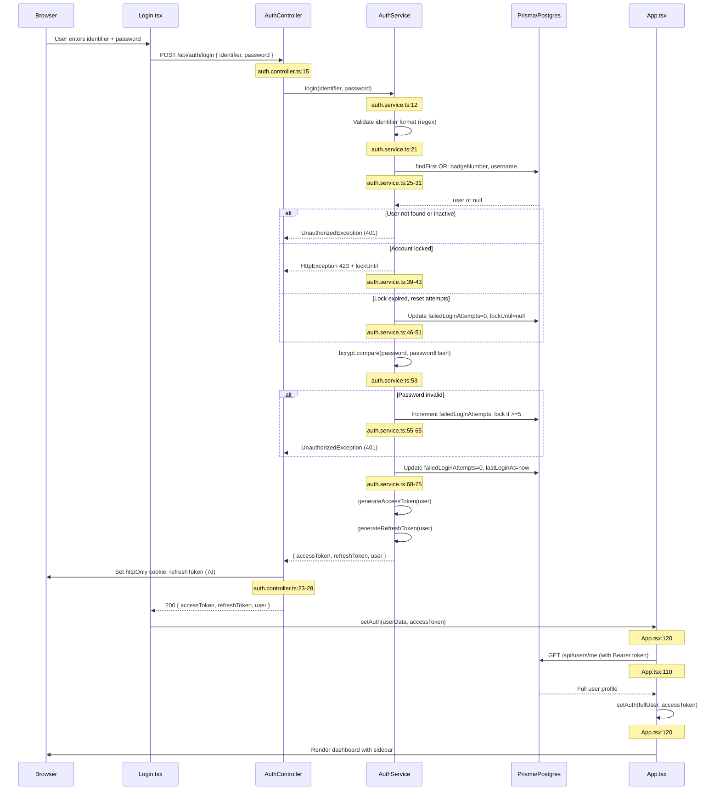
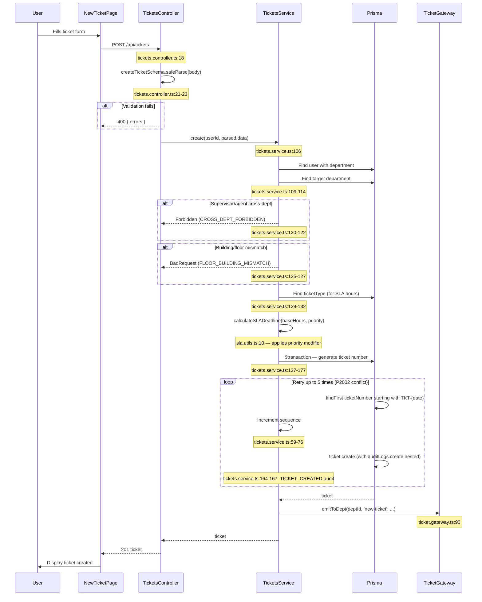
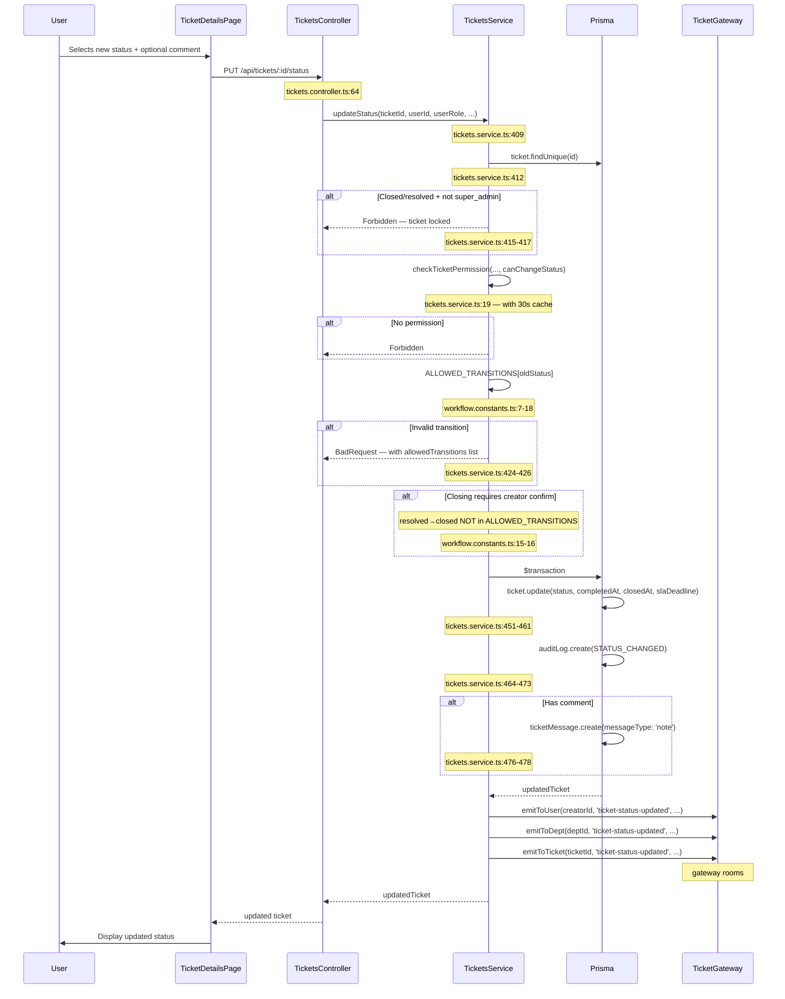
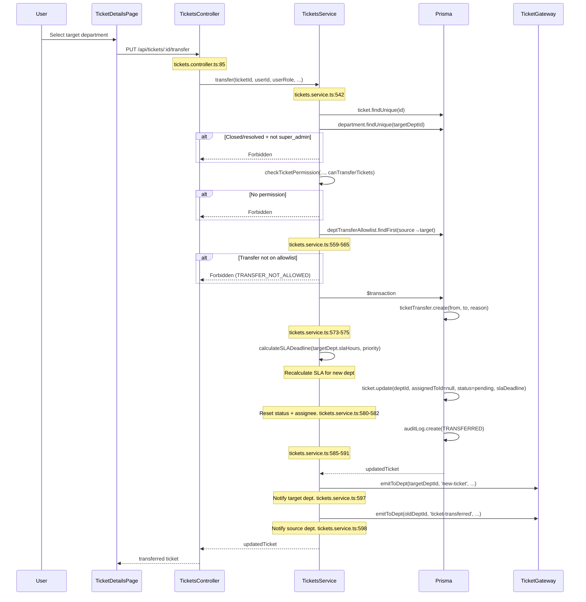
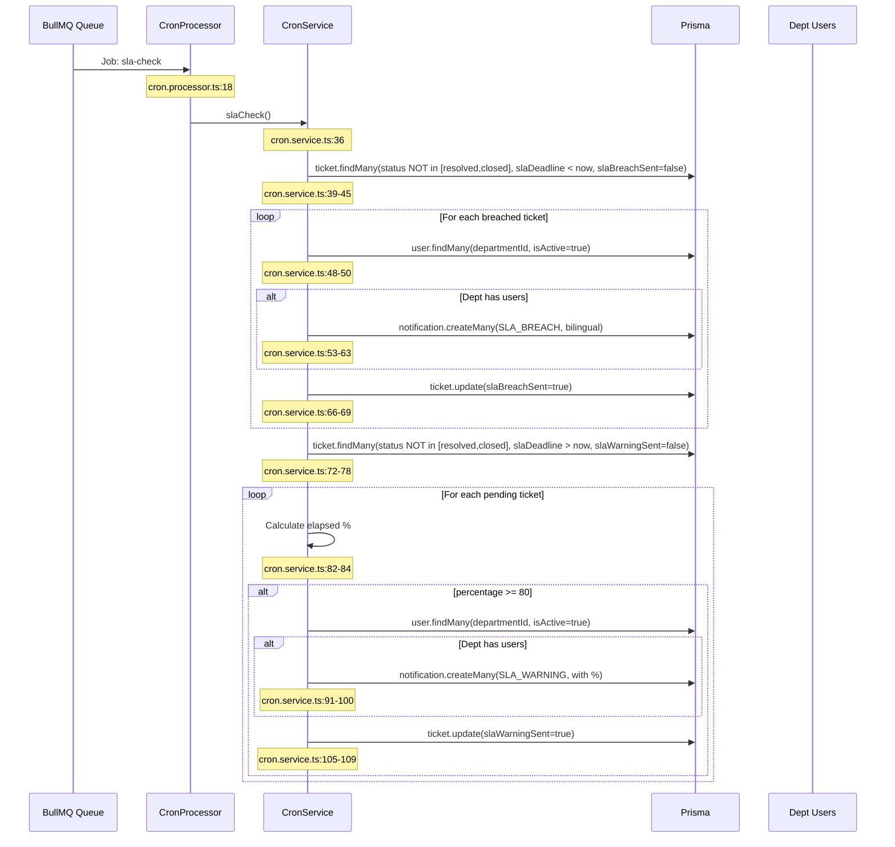
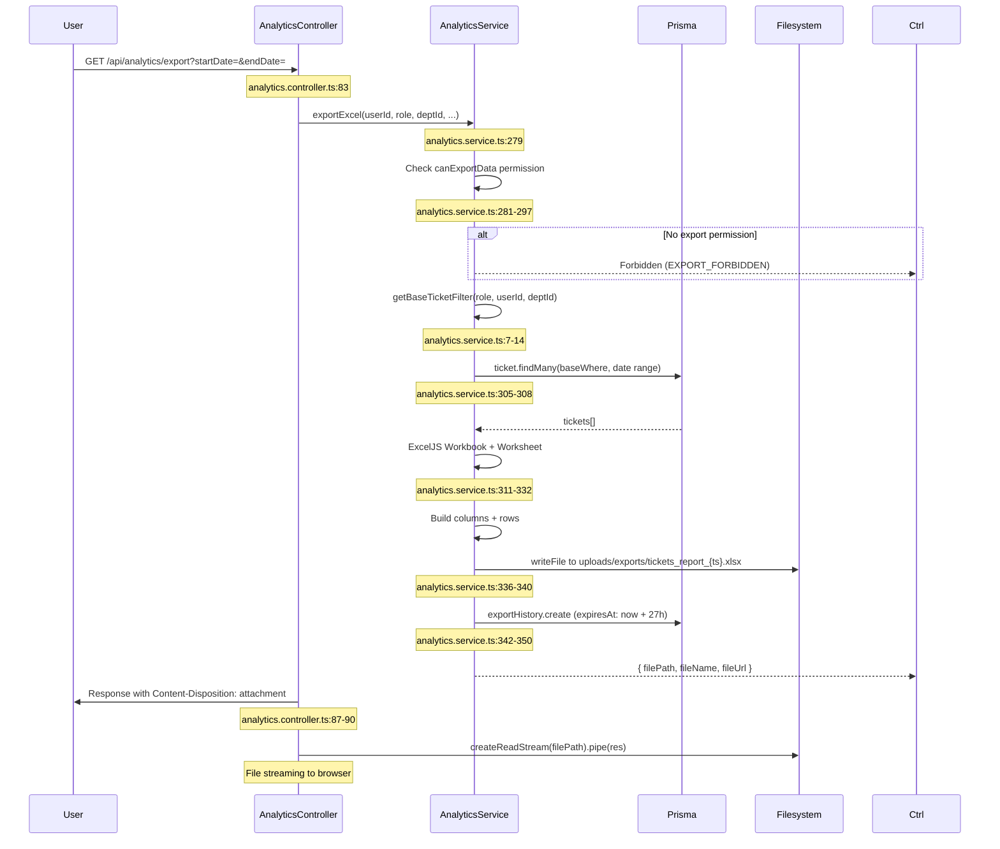
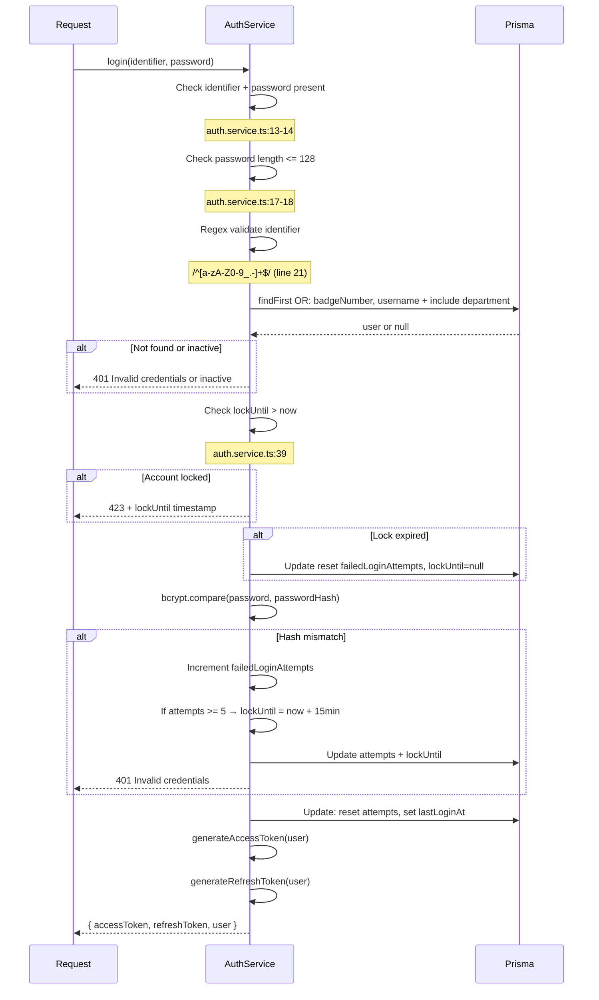

# Sequence Diagrams

All diagrams based on actual code paths. File:line references noted per step.

---

## 1. Login Sequence

**Sources:** `frontend/src/pages/Login.tsx` (inferred, not read), `auth.controller.ts:15-35`, `auth.service.ts:12-93`, `frontend/src/App.tsx:104-141`

---

## 2. Ticket Creation

**Sources:** `tickets.controller.ts:18-26`, `tickets.service.ts:106-181`, `workflow.constants.ts`, `sla.utils.ts:10-25`

---

## 3. Ticket Status Change

**Sources:** `tickets.controller.ts:64-67`, `tickets.service.ts:409-488`

---

## 4. Ticket Transfer

**Sources:** `tickets.controller.ts:85-87`, `tickets.service.ts:542-599`

---

## 5. SLA Check Cron

**Sources:** `cron.service.ts:36-111`, `cron.processor.ts:18`

---

## 6. Analytics Export

**Sources:** `analytics.controller.ts:83-92`, `analytics.service.ts:279-353`

---

## 7. User Authentication Flow (Login Deep Dive)

**Sources:** `auth.service.ts:12-93`

